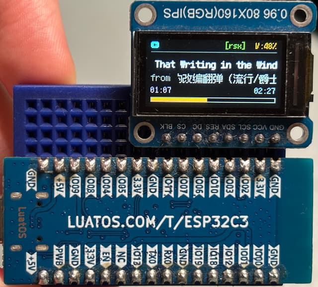

# esp32-mpd-display

一个运行在 ESP32-C3 上的 MPD（Music Player Daemon）远程显示客户端，使用 0.96 寸 ST7735S IPS 屏幕（80×160，横向）实时展示当前播放信息。



---

## 功能

- 实时显示曲名、艺术家、专辑、播放进度、音量
- 播放模式标志：repeat / random / single / consume / crossfade
- 曲名 / 艺术家 / 专辑超长时自动跑马灯，**速度自适应文本长度**，长短文本来回周期一致
- 艺术家与专辑每 7 秒交替翻页
- 播放进度在本地补帧，不依赖 MPD 轮询频率，秒针平滑
- 非阻塞 MPD 状态机，TCP 通信不阻塞 LVGL 渲染
- MPD 保持长连接，避免每秒重连

---

## 硬件

| 组件 | 规格 |
|------|------|
| 主控 | ESP32-C3（RISC-V，160MHz，320KB RAM） |
| 屏幕 | 0.96" ST7735S，80×160，IPS，SPI 接口 |
| 使用方向 | 横向（rotation = 3） |

### 引脚连接

| TFT 引脚 | ESP32-C3 GPIO |
|----------|---------------|
| CS       | GPIO7         |
| DC       | GPIO6         |
| RST      | GPIO10        |
| MOSI     | GPIO3         |
| SCLK     | GPIO2         |
| BL       | 3.3V（常亮）   |
| VCC      | 3.3V          |
| GND      | GND           |

引脚在 `include/User_Setup.h` 中配置（TFT_eSPI 标准配置方式）。

---

## 快速开始

### 1. 克隆仓库

```bash
git clone https://github.com/YOUR_USERNAME/esp32-mpd-display.git
cd esp32-mpd-display
```

### 2. 配置 WiFi 和 MPD

编辑 `src/main.cpp` 顶部的常量：

```cpp
static const char* WIFI_SSID     = "YOUR_WIFI_SSID";
static const char* WIFI_PASSWORD = "YOUR_WIFI_PASSWORD";
static const char* MPD_HOST      = "192.168.x.x";   // MPD 服务器局域网 IP
static const int   MPD_PORT      = 6600;
```

### 3. 编译 & 上传

```bash
pio run -t upload
```

> **无需任何手动修改！** `extra_scripts` 会在编译前自动应用必要的库补丁（见下方说明）。

---

## 依赖

| 库 | 说明 |
|----|------|
| [TFT_eSPI](https://github.com/Bodmer/TFT_eSPI) | 硬件 SPI 驱动，`pushImage()` 批量传输，比 Adafruit 快 10x+ |
| [LVGL](https://lvgl.io/) | UI 框架，版本 8.x |
| Arduino WiFi / WiFiClient | ESP32 Arduino core 内置 |

字体使用 [Fusion Pixel](https://github.com/TakWolf/fusion-pixel-font)（12px、10px、8px），以 LVGL 的 `LV_FONT_DECLARE` 方式引入。

---

## 配置

其余可调参数（在 `src/main.cpp` 中）：

```cpp
static const unsigned long MPD_INTERVAL_MS  = 1000;  // MPD 轮询间隔（ms）
static const unsigned long FLIP_INTERVAL_MS = 7000;  // 艺术家/专辑翻页间隔（ms）
```

跑马灯单程时长在 `setup_ui()` 里通过 `scroll_label_register(label, period_ms)` 设置，默认 3000ms。

---

## 屏幕布局

```
Y= 0  ┌─────────────────────────────┐
      │ ▶ 播放状态       [rz--] V:80% │  ← fusion_pixel_10
Y=14  ├─────────────────────────────┤
Y=18  │ 歌曲名（自适应速度跑马灯）    │  ← fusion_pixel_12
Y=34  │ by 艺术家 / from 专辑（翻页）│  ← 每 7s 切换
Y=55  │ 00:00               03:45   │  ← 已播 / 总时长
Y=68  │ ████████░░░░░░░░░░░░░░░░░░  │  ← 进度条
Y=80  └─────────────────────────────┘
```

状态图标颜色：播放 = 电子深青，暂停 = 铓锣灰，停止 = 暗红。

---

## ESP32-C3 兼容性说明

本项目使用 **ESP32-C3**（RISC-V 架构），与 ESP32 相比有以下特殊注意事项：

### 自动补丁（extra_scripts）

TFT_eSPI 库在 ESP32-C3 上存在两个已知 bug，本项目通过 `patches/apply_patches.py` 在编译时自动修复：

| 补丁 | 问题 | 修复 |
|------|------|------|
| **SPI_PORT** | `TFT_eSPI_ESP32_C3.h` 中 `#define SPI_PORT SPI2_HOST`，但 `SPI2_HOST=1`，而 `REG_SPI_BASE(i)` 宏要求 `i==2` 才返回有效地址 | 改为 `#define SPI_PORT 2` |
| **writecommand(0x00)** | `TFT_eSPI.cpp` 中在 `begin_tft_write()` 之前调用 `writecommand(0x00)`，此时 SPI 事务尚未开始，导致崩溃 | 删除该行 |

补丁脚本通过 `platformio.ini` 中的 `extra_scripts = patches/apply_patches.py` 自动执行，无需手动干预。

---

## 性能优化说明

- MPD 响应用静态 `char` 数组接收，避免 `String` 堆碎片
- UI 脏检查：内容未变时跳过 `lv_label_set_text`，减少 LVGL 重绘
- 时间标签和进度条只在整秒跳变时更新
- LVGL 缓冲区全屏（160×80），减少 flush 次数
- 跑马灯速度在文本变化后延迟 4 帧读取 `scroll_right`，等待 LVGL layout 稳定后再计算，避免取到旧值

---

## License

MIT
